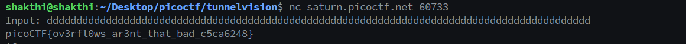
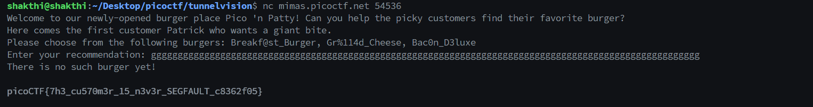

# Binary Exploitation

This module is about binary exploitation.

## Buffer Overflow 0

### Thought process and approach

While reviewing the source code, I noticed that the program reads the flag from a file named `flag.txt` and stores it in a character array called `flag`:

```
  #define FLAGSIZE_MAX 64
  char flag[FLAGSIZE_MAX];
  FILE *f = fopen("flag.txt","r");
  if (f == NULL) {
    printf("%s %s", "Please create 'flag.txt' in this directory with your",
                    "own debugging flag.\n");
    exit(0);
  }
  
  fgets(flag,FLAGSIZE_MAX,f);
```

The program also includes a custom function to handle segmentation faults, which prints the contents of the `flag` array:

```
 void sigsegv_handler(int sig) {
  printf("%s\n", flag);
  fflush(stdout);
  exit(1);
 }

 signal(SIGSEGV, sigsegv_handler); // Set up signal handler
```

Additionally, the program reads input data from the user and copies it into another variable.

```
void vuln(char *input){
  char buf2[16];
  strcpy(buf2, input);
}
```

After doing some research, I found that the SIGSEGV signal is sent to the program when the buffer overflows. `strcpy` can be used to overflow the buffer and send the SIGSEGV signal to the program. I just spammed a lot of text to the program to trigger the SIGSEGV signal and get the flag.




### The FLAG

The flag is:

```
picoCTF{ov3rfl0ws_ar3nt_that_bad_c5ca6248}
```

## Format String 0

### Thought process and approach

Examining the program, I noticed that this program also uses defines a `sigsegv_handler` function to handle segmentation faults which prints out the flag. So I just tried spamming the program with a lot of text to try and trigger teh `SIGSEGV` signal and it worked.



### The FLAG

The flag is:

```
picoCTF{7h3_cu570m3r_15_n3v3r_SEGFAULT_c8362f05}
```