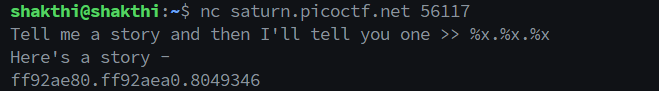

# Binary Exploitation

This module is about binary exploitation.

- [Binary Exploitation](#binary-exploitation)
  - [Buffer Overflow 0](#buffer-overflow-0)
    - [Thought process and approach](#thought-process-and-approach)
    - [The FLAG](#the-flag)
  - [Format String 0](#format-string-0)
    - [Thought process and approach](#thought-process-and-approach-1)
    - [The FLAG](#the-flag-1)
  - [flag leak](#flag-leak)
    - [Thought process and approach](#thought-process-and-approach-2)
    - [The FLAG](#the-flag-2)

## Buffer Overflow 0

### Thought process and approach

While reviewing the source code, I noticed that the program reads the flag from a file named `flag.txt` and stores it in a character array called `flag`:

```
  #define FLAGSIZE_MAX 64
  char flag[FLAGSIZE_MAX];
  FILE *f = fopen("flag.txt","r");
  if (f == NULL) {
    printf("%s %s", "Please create 'flag.txt' in this directory with your",
                    "own debugging flag.\n");
    exit(0);
  }
  
  fgets(flag,FLAGSIZE_MAX,f);
```

The program also includes a custom function to handle segmentation faults, which prints the contents of the `flag` array:

```
 void sigsegv_handler(int sig) {
  printf("%s\n", flag);
  fflush(stdout);
  exit(1);
 }

 signal(SIGSEGV, sigsegv_handler); // Set up signal handler
```

Additionally, the program reads input data from the user and copies it into another variable.

```
void vuln(char *input){
  char buf2[16];
  strcpy(buf2, input);
}
```

After doing some research, I found that the SIGSEGV signal is sent to the program when the buffer overflows. `strcpy` can be used to overflow the buffer and send the SIGSEGV signal to the program. I just spammed a lot of text to the program to trigger the SIGSEGV signal and get the flag.


### The FLAG

The flag is:

```
picoCTF{ov3rfl0ws_ar3nt_that_bad_c5ca6248}
```

## Format String 0

### Thought process and approach

Examining the program, I noticed that this program also uses defines a `sigsegv_handler` function to handle segmentation faults which prints out the flag. So I just tried spamming the program with a lot of text to try and trigger teh `SIGSEGV` signal and it worked.


### The FLAG

The flag is:

```
picoCTF{7h3_cu570m3r_15_n3v3r_SEGFAULT_c8362f05}
```

## flag leak

### Thought process and approach

Analysing the progrm, I noticed that the program creates two arrays on the stack:

```
char flag[BUFSIZE];
char story[128];
```

It calls a function that reads the flag from a file called `flag.txt` and stores it in the `flag` array using a function. I saw the hints and realised that we need to use format specifiers to read the flag from the flag array. I went through this [resource](https://ctf101.org/binary-exploitation/what-is-a-format-string-vulnerability/) mentioned in the task phase pdf to understand how format string vulnerabilities work. 

I used the `%x` format specifier to read data from the stack. `%x` format specifer reads data from the stack and prints it as a hexadecimal value. But I dont know how far the flag is from the stack pointer. 



On some further research, I found that we can use `%s` format specifier to read data from the stack in a string format. Our flag is a string so I thought this would work. Also we can mention the specific index of the stack with this syntax: `%n$s`. I tried passing some random values and got null values and garbage values. 


I decided to loop through the indexes in hopes of finding the flag. As per my knowledge the fist element in the stack is the story array followed by the flag array. So somewhere we should find the flag. 

```
for i in {1..100}; do
  echo "Trying i = $i"
  echo %"$i"\$s | nc saturn.picoctf.net 56117
done
```

Running this command, it started to print different strings from the array and I found the flag at index 24.


### The FLAG

Fixing the format of the flag:

```
picoCTF{L34k1ng_Fl4g_0ff_St4ck_11a2b52a}
```