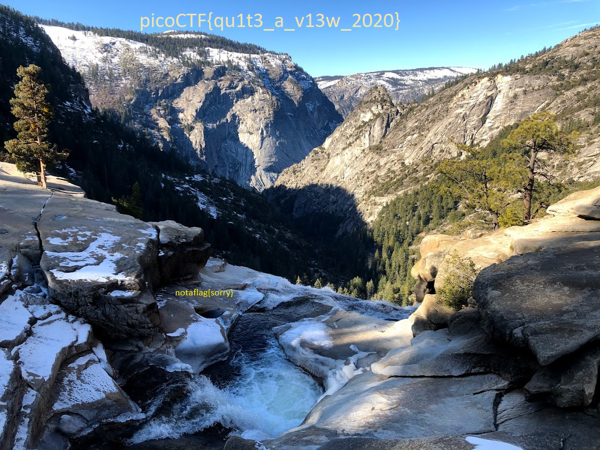
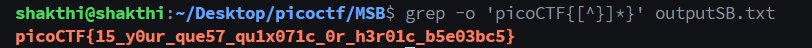

# Forensics

This module is about forensics.

- [Forensics](#forensics)
  - [Trivial Flag Transfer Protocol](#trivial-flag-transfer-protocol)
    - [Thought process and approach](#thought-process-and-approach)
    - [Resources used](#resources-used)
    - [Concept and knowledge gained](#concept-and-knowledge-gained)
    - [The FLAG:](#the-flag)
  - [tunn3l v1s10n](#tunn3l-v1s10n)
    - [Thought process and approach](#thought-process-and-approach-1)
    - [Resources used](#resources-used-1)
    - [Concepts and knowledge gained](#concepts-and-knowledge-gained)
    - [The Flag](#the-flag-1)
  - [m00nwalk](#m00nwalk)
    - [Thought process and approach](#thought-process-and-approach-2)
    - [Resources used:](#resources-used-2)
    - [Concepts and knowledge gained](#concepts-and-knowledge-gained-1)
    - [The FLAG:](#the-flag-2)
  - [m00nwalk 2](#m00nwalk-2)
    - [Thought process and approach](#thought-process-and-approach-3)
    - [The Flag:](#the-flag-3)
  - [MSB](#msb)
    - [Thought process and approach](#thought-process-and-approach-4)
    - [The Flag:](#the-flag-4)

## Trivial Flag Transfer Protocol

### Thought process and approach 

I downloaded the `tftp.pcapng` from the website. I was familiar with `pcap` files but wasn't sure what `pcapng` meant so I googled it. It turns out thats its an upgrade to the `pcap` format. I worked with `pcap` files in KernelCTF so I opened it in Wireshark.


There seems to be an `instructions.txt` file being transmitted but it was all in the format of data packets so I looked for a tool to recover the files. I went through the resources provided in the pdf and came across [Network Miner](https://www.netresec.com/?page=NetworkMiner). I downloaded it and tried to import the `tftp.pcapng` file but it required premium to open so I converted the `pcapng` file into a `pcap` file using `editcap -F tftp.pcapng tftp1.pcap` and opened it in Network Miner.


I downloaded all the files from Netork Miner into a folder. When I opened `instructions.txt`, I found it to be encrypted. I tried to decrypt it using different ciphers in `CyberChef` and found that it was encrypted using `ROT13`. Decrypting it gave:

```
TFTP DOESNT ENCRYPT OUR TRAFFIC SO WE MUST DISGUISE OUR FLAG TRANSFER. FIGURE OUT A WAY TO HIDE THE FLAG AND I WILL CHECK BACK FOR THE PLAN
```

There was also a `plan` file which was also encrypted using `ROT13`. Decrypting it gave:

```
I USED THE PROGRAM AND HID IT WITH - DUEDILIGENCE. CHECK OUT THE PHOTOS
```

There was a `program.deb` file which I tried to install, When trying to install, I found out that it was `steghide`:


I have used `steghide` in a previous CTF so I knew that it's used to hide files in images. I tried to extract the different image files I got from Network Miner, providing the password as `DUEDILIGENCE`. In the `picture3.bmp` file, I got the file `flag.txt` which contained the flag:


### Resources used

- [Wireshark](https://www.wireshark.org/)
- [Network Miner](https://www.netresec.com/?page=NetworkMiner)
- [CyberChef](https://gchq.github.io/CyberChef/)
- **Steghide**

### Concept and knowledge gained

- Learnt working with `pcap` files using `Wireshark`.
- Learnt using `Steghide` to extract files from images.
- Learnt about `Netork Miner` and how it can be used to extract files from `pcap` files.

### The FLAG:

The flag is:

```  
picoCTF{h1dd3n_1n_pLa1n_51GHT_18375919}
```

## tunn3l v1s10n

### Thought process and approach

I downloaded `tunnel_vision` from the website and ran the `file` command on it but it didn't tell anything about the file type. Then I ran `exiftool` and it told me that the file is a bitmap image file.


I renamed the file to `tunnel_vision.bmp` and tried opening it but I got an error saying the header might be corrupted. I opened the file in a hex editor and saw that the header was intact. I opened the wikipedia page for `BMP` files and read that the header is 14 bytes long and the last 4 bytes of the header dictate the offset of the pixel array. The header is 14 bytes long and the following `DIB header` is 40 bytes long so there is an offset of 54 bytes. I converted 54 to hex which is `36` and changed the last 4 bytes of the header to `36 00 00 00` but the image still did not open.

I read more about the `DIB header` and read that the first 4 bytes dictate the size of the said header. The `DIB header` is 40 bytes long so I converted 40to hex which is `28` and changed the first four bytes to `28 00 00 00 ` and saved the file. Now the image actually opened but there was a decoy flag.


The next 8 bytes of `DIB header` dictate the size of the image. The first 4 bytes of the `DIB header` dictate the width of the image and the next 4 four bytes dictate the height of the image. Our file's total size is 2893454 bytes. So subracting the headers from the size and dividing the width*3 since each pixel is 3 bytes, I got the height of the image to be 850. I converted 850 to hex which is `352` and changed the next 4 bytes of the `DIB header` to `52 03 00 00` and saved the file. Opening the file, I got the flag.



### Resources used

 - **exiftool**
 - [Hexed.it](https://hexed.it/)
 - Wikipedia page for `BMP` files
  
### Concepts and knowledge gained

- Learnt about the structure of `BMP` files.
- Got more comfortable with using a hex editor.

### The Flag

The flag is:

``` 
picoCTF{qu1t3_a_v13w_2020}
```

## m00nwalk

### Thought process and approach 

After downloading the `wav` file from the website, I tried using a morse decoder and a spectogram analyser but I could not find anything. I saw the hints and looked up which protocol NASA used to transmit the live telecast to televisons. They used the `SSTV` protocol and converted into `NTSC` format to transmit the live telecast. 


I started looking for tools to decode `SSTV` to images. I came across this [tool](https://github.com/colaclanth/sstv). I cloned the repository and setup the package. After going through the descripton of the tool, I noticed that there are different modes for decoding the data. Incidently the second hint of the challenge mentioned that the mascot of the college might help us get the mode. After a quick google search, I found out that the mascot is called `Scotty` and is a Scottish Highland Terrier.


One of the options mentioned in the tool was `Scottie 1, 2, DX` which corresponds with the mascot's name - `Scotty`


The tool automatically detects the mode so I did not have to mention it. I ran `sstv -d message.wav -o output.png` and got an image. Opening the image, I found the flag.


### Resources used:

 - [SSTV tool](https://github.com/colaclanth/sstv)

### Concepts and knowledge gained

- Learnt about the `SSTV` protocol.
- Learnt about how NASA's live telecast was transmitted to televisions.
  
### The FLAG:

The flag is:

```  
picoCTF{beep_boop_im_in_space}
```

## m00nwalk 2

### Thought process and approach 

Like the previous m00nwalk challenge, I used the SSTV tool on the four `wav` files I downloaded on the website and got the following images:


There seems to be a flag in `message.png` but it's the flag for `m00nwalk` challenge. In `clue3.png`, the words `Alan Eliasen the FutureBoy` are written. I searched for these words on google and found a website that had tools for Stenaography along with other tools. 


Even the password provided in `clue1.png` hints at Stenaography. I thought the flag might be hidden in `message.png` so I used `Steghide` to look for hidden files. I was not able to find any hidden files in `message.png` and I was stuck. While reading up on steghide, I found that it can also be used for `wav` files. Using the password provided in `clue1.png`, I ran `steghide extract -sf message.wav -p hidden_stegosaurus` and got a file containing the flag

### The Flag:

```
picoCTF{the_answer_lies_hidden_in_plain_sight}
```

## MSB

### Thought process and approach

In the challenge description, they mention `LSB statistical analysis` but I had no clue what it was so I searched for it on google. I found out that `LSB` stands for `Least Significant Bit` and is used in steganography to hide data in images. While reading up `LSB`, I came across `MSB` which stands for `Most Significant Bit`. The challenge name is `MSB` so I thought that the flag might be hidden using `MSB`. While looking for a tool to decode `MSB`, I came across [sigBits](https://github.com/Pulho/sigBits).

I installed the dependecies and ran `sigBits.py` with the mode set as the `msb` and with the image downloaded from the website.


It gave me a text file containing a lot of random sentences so I used `grep` to filter out the flag.



### The Flag:

```
picoCTF{15_y0ur_que57_qu1x071c_0r_h3r01c_b5e03bc5}
````