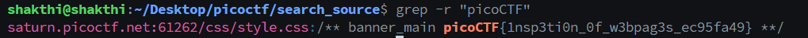

# Web Exploitation

This module is about web exploitation.

- [Web Exploitation](#web-exploitation)
  - [SOAP](#soap)
    - [Thought process and approach](#thought-process-and-approach)
    - [Resources used](#resources-used)
    - [The FLAG](#the-flag)
  - [Forbidden Paths](#forbidden-paths)
    - [Thought process and approach](#thought-process-and-approach-1)
    - [The FLAG](#the-flag-1)
  - [Cookies](#cookies)
    - [Thought process and approach](#thought-process-and-approach-2)
    - [The FLAG](#the-flag-2)
  - [Search source](#search-source)
    - [Thought process and approach](#thought-process-and-approach-3)
    - [The FLAG](#the-flag-3)
  - [MatchTheRegex](#matchtheregex)
    - [Thought process and approach](#thought-process-and-approach-4)
    - [The FLAG](#the-flag-4)


## SOAP

### Thought process and approach

The description states that the flag is stored in `/etc/passwd `. Opening the website, I had no clue what to do so I read the hints. It hinted that we need to use a XML external entity Injection. Searching for resources on this topic, I found this [article](https://portswigger.net/web-security/xxe) which explained the concept of XXE Injection. 

Whenever I click on details for any of the following, a xml request is sent to the server containing the specific id. Reading up on the article, I found that we can inject our own script to read the file `/flag.txt`. 


I tried using Burp Suite to intercept the requests but I couldn't get it to work. So I used dev tools to copy the request as a curl command and imported it in Postman. Now I could modify the requests and get the corresponding responses. The article had a payload for a very similar case (even the file name was the same). I modified the payload as:

```
<?xml version="1.0" encoding="UTF-8"?>
<!DOCTYPE foo [ <!ENTITY xxe SYSTEM "file:///etc/passwd"> ]>
<data><ID>&xxe;</ID></data>
```

Sending this request, I got the flag.

!

### Resources used

- [Postman](https://www.postman.com/)
- [XXE Injection](https://portswigger.net/web-security/xxe)
  
### The FLAG

The flag is:

```
picoCTF{XML_3xtern@l_3nt1t1ty_e5f02dbf}
```

## Forbidden Paths 

### Thought process and approach 

Reading the description of the challenge, I understood that our flag is stored in `/flag.txt ` and the files for hosting the website are located at `/usr/share/nginx/html/`. When I visit the website, I find out that we can pass in any file path and it will display the contents of the file. But the challenge description clearly states that absolute file paths are filtered. 

Thanks to the cryptonite taskphase 1, I knew that we can bypass this by using relative paths. The `..` operator is used to go back a directory. and we are inside the `/usr/share/nginx/html/` directory. So, I tried to access the flag using the relative path `../../../flag.txt` and it displayed the flag.


### The FLAG

The flag is:

```
picoCTF{7h3_p47h_70_5ucc355_e5a6fcbc}
```

## Cookies

### Thought process and approach 

After going to the site, I opened the developer tools and checked the cookies. I found a cookie named `name` with the value `-1`. Keeping the developer tools open, I entered `snickerdoodle` in the input box and click the `Search` button and the value of the cookie changed to `0`. I entered `chocolate chip` and the value changed to `1`. Every time I entered a value, the value of the cookie also changed. I wrote a python script that kept changing the value of the cookie and print out the response if it contained `picoCTF` in it. I looped through the values from 0 to 50.

```
import requests

for i in range(50):
    
    headers = {'Cookie': f'name={i}'}
    r = requests.get('http://mercury.picoctf.net:27177/check', headers=headers)
    if (r.status_code == 200) and ('picoCTF' in r.text):
        print(r.text)
        break
```

Running this script and waiting for a while it printed out the response. Saving it to a file and opening it, I found the flag.


### The FLAG

The flag is:

```
picoCTF{3v3ry1_l0v3s_c00k135_064663be}
```

## Search source

### Thought process and approach

I went to the website and tried to inspect the source code using devtools but there were way too many files and it would have taken a lot of time to go through all of them. So, I thought of downloading the source code and then I could search for the flag using grep. I found this [article](https://www.howtogeek.com/how-to-copy-a-whole-website-to-your-computer-using-wget/) demonstrating how to do so. Following the instructions, I was able to download the source code. 

I knew grep could be used for searching through multiple files but I wasn't sure how to do it. I went through the man page for grep and found that the `-r` flag is used to search through directories recursively. I ran the following command to search for the flag.

```grep -r "picoCTF"```

This command searched through all the files in the directory and found the flag.



### The FLAG

The flag is:

```
picoCTF{1nsp3ti0n_0f_w3bpag3s_ec95fa49}
```

## MatchTheRegex

### Thought process and approach

When I went to the website, I was presented with a box to input text and a submit button. I decided to open devtools and look at the source as it was a simple webpage. While inspecting the code, I found this part which sends the inputed text to `/flag?input=${val}` to check wheter the input matches the regex pattern.

```
  function send_request() {
    let val = document.getElementById("name").value;
    // ^p.....F!?
    fetch(`/flag?input=${val}`)
      .then(res => res.text())
      .then(res => {
        const res_json = JSON.parse(res);
        alert(res_json.flag)
        return false;
      })
    return false;
  }
```

 The regex pattern ^p.....F  is commented n send_request() source. While examining the pattern, I found that ^ anchors the pattern to the start of the text, . is matching on any character and finally it ends with a F character. `picoCTF` matches this pattern. When I entered `picoCTF` in the input box and clicked the `Submit` button, I was able to get the flag.

 

### The FLAG

The flag is:

```
picoCTF{succ3ssfully_matchtheregex_9080e406}
```